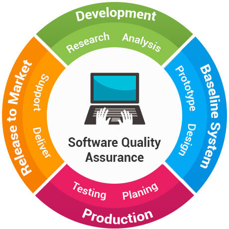

# Quality assurance

# What is QA (Quality Assurance) and what QA engineer does?

- Quality assurance is optimizing the development and testing processes
- Selecting approaches to minimize the number of errors
- Bring quality to the product
- Make sure the requirements are met.
- Know the business
- Know the product

# What is software testing?
- Making sure the requirements are sound.
- Think about what the software should do.
- Think about the UX (User Experience)

| What software testing is | What software testing is not |
| ------------------------ | ---------------------------- |
| Making sure the software provides the expected value to the user.  Try to get information about the business and software that might provide value to the stakeholders. | Simple, quick, predictable. Only making sure the  software matches the description. |
| Mitigating surprises before problems happen | Increasing quality |
| Exploring products | Well understood and valued by everyone |
| Communicating with stakeholders (costumers, users, developers) and work with together to improve the product | A phase that a product needs to go through to be successful |
| Infinite. All testing is sampling and there are various ways and parameters that can be tested | Ever finishing. There are an infinite number of ways to test a product |

**Answer:** 
- Making sure requirements are attained and that the software is developed according to those requirements.
- Try to foresee problems with the software before they happen. Make sure there are not surprises.
- Communicate and work with other stakeholders (interested parts including colleagues) from other disciplines to make sure we are all on the same page and that we are all working toward the same goal.
- Test and give feedback about the developed work each iteration (sprint) to make sure the work goes according to the requirements.
- Make sure the requirements are still valid and propose or change new requirements according to what the users want or needs. 
- Try to see beyond the requirements to make sure the product not just goes according to the requirements asked by the client but also to see things that the client did not foresee that might be beneficial to include as requirements for the software.

# How to test software (in abstract)?

- Automatic tests
	- Unitary tests
	- End to end tests
- Manual tests
- Using testing software
- Creating user stories to simulate user experience and use of functionalities and the use of the software itself.
- Using personas that allow us to simulate the different kinds of users that may need to utilize our aplication. This way we can see if our requirements go in hand with all our different users and their needs.
- White box tests: Where the tester has acess to the internal code and can make unitary tests to each component.
	- This kind of testing can focus too much on what is already implemented and not on what needs to be implemented according to the requirements (or even functionalities that are missing or not yet required but should be).
- Black box test: Where the tester does not have acess to the internal code and can only test inputs and outputs.
	- This kind of test allows the tester to test the application without any bias to the code written. This way the tester tests the software according to his own needs and expectations. But the tester also may miss to cover all cases because without knowing the code he can't know if he tested everything.
- Accessibility tests (for someone with a handicap)
- Test UX
- Regression testing: Reverify if the software still works correctly and passes all tests already done after we introduce new code or features to the software. 
- Pair testing
- Mob Testing
- Test for dark patterns (can be good or bad)
- Mobile testing (if applicable)
- Security testing
- Performance testing

# Quality Assurance vs Quality Control?

 **QA**
 - Based on processes
 - Builds quality in
 - Focus is on the development and design phase of the software to ensure the software is built with quality
 - Prevent problems before they happen
 - Improving production processes
 - Quality is built into the product
 - Focus on the whole business
 - Constantly try to improve processes and the product, having the client on sight
 
 **QC**
- Based on inspection
- Takes defect out
- After it is developed

| QA | Testing |
| :---: | :---------: |
| Define requirements | Inspect product |
| Set up deliverables | Correct bugs and defects |
| Automate processes |  |

# What is the role of a junior QA eng. ?

- Understand the product
- Understand how the product is going to be used
- Understand the business
- Understand the technologies being used
- Set up use cases to test the product (follow instruction)
- Report bugs found

# How a team works in an Agile environment?

Agile is Iterative

Design -> Code -> Test = Deploy 

Example: 
| Sprint 0 | Sprint 1 | Sprint 2 | Sprint 3 | Final Sprint |
| --- | --- | --- | --- | --- |
| Design | Design | Design | Design | Deploy |
| Code | Code | Code | Code |  
| Test | Test | Test | Test |  

In Agile projects are completed in a continuous work fashion by setting requirements, then planning and measuring results to improve the work with each iteration. This way, by doing work in small increments, it is possible to readjust requirements and plans quickly by measuring the work done each sprint each increment and deliver better results.

# What is Agile?

Agile is a set of working Values. It is an iterative way to manage a project and software development where a team delivers a product in small increments instead of one big deliver.

# How does QA team work in an Agile environment?

1. Planning
2. Documentation and communication
3. Automation
4. Metrics
5. Continuous improvement

QA team always look to improve the process of work each iteration to improve the quality of the product and the value it can bring to the client.

# What is Scrum?

- Team framework 
- Encourages team members to work together 
- Encourages learn through experience
- Promotes self-organize while working on a problem
- Reflect on their wins and losses looking for continuous improvement.

# What are Sprints?

# Sources

https://www.ministryoftesting.com/dojo/lessons/30-things-every-new-software-tester-should-learn
https://www.ministryoftesting.com/dojo/lessons/what-do-software-testers-do-version-0-1
https://www.softwaretestinghelp.com/software-quality-assurance/