[Go to wiki](./../../README.md)

# Software Introduction

  * [What are some considerations to have with software?](#what-are-some-considerations-to-have-with-software)
  * [What are the phases of software development?](#what-are-the-phases-of-software-development)
  * [How to assess requirements?](#how-to-assess-requirements)
  * [What is OO Analisys?](#what-is-oo-analisys)
  * [What is Domain Model?](#what-is-domain-model)
  * [How to identify conceptual classes?](#how-to-identify-conceptual-classes)
  * [How to identify associations?](#how-to-identify-associations)
  * [How to identify attributes?](#how-to-identify-attributes)
  * [What is OO Design?](#what-is-oo-design)
  * [What is Responsability-Driven Design (RDD)?](#what-is-responsability-driven-design--rdd)
  * [What is General Responsability Assignment Software Patterns (GRASP) ?](#what-is-general-responsability-assignment-software-patterns--grasp)
    + [Information expert principle](#information-expert-principle)
    + [Creator principle](#creator-principle)
    + [Controller principle](#controller-principle)
    + [Low Coupling principle](#low-coupling-principle)
    + [High Coesion principle](#high-coesion-principle)
    + [Polymorphism principle](#polymorphism-principle)
    + [Indirection principle](#indirection-principle)
    + [Pure Fabrication principle](#pure-fabrication-principle)
    + [Protected Variations principle](#protected-variations-principle)
  * [What is Modularity?](#what-is-modularity)
  * [What is extension, implementation and association (and how to represent in UML)?](#what-is-extension--implementation-and-association--and-how-to-represent-in-uml)
  * [What is Aggregation and Composition?](#what-is-aggregation-and-composition)
- [Sources](#sources)
- [References](#references)

<small><i><a href='http://ecotrust-canada.github.io/markdown-toc/'>Table of contents generated with markdown-toc</a></i></small>

---

## What are some considerations to have with software?

Software is intangible, unusually flexible, non-standardized. Software engineering is not recognized like an engineering like other areas like mechanic, eletric, civil, etc. Still, it is necessary to introduce methods, models and processes that lead to a consistent and efficent development of software due to its importance on a current daily basis.

[Back to top](#software-introduction)

## What are the phases of software development?

**Requirements**
Identify what the stakeholders want from the software and establish the restrictions. 

**Analisys**
*Do the right thing*.
Assessment of the requirements and explore the details. 
e.g. requiremente analisys or OO analisys.

**Design**
*Do the thing right*.
Conceptual solution that expects to accomplish the requirements.
Can lead to implementation but it is not implementation.
e.g. architecture design, use case OO design, database design.

**Implementation**
*Build the thing*.

[Back to top](#software-introduction)

## How to assess requirements?

**Vision**
Vision includes the great ideas for the project:
- The reason for the project;
- What are the problems;
- The stakeholders;
- The needs;
- The perspective for a solution.

**Use cases** can help define and communicate a use case requirements to explain the needs for the software. It describes the scenery of a problem that the software wants to solve. This can be described in text form or with the use of UML. e.g. use case diagram, system sequence diagrams

[Back to top](#software-introduction)

## What is OO Analisys?

Think in objects:
- Attributes (data);
- Relationships (with other objects);
- Behaviour.

OO analisys seeks to assess the domain objects in a domain object model. It intends to turn the requirements into an aproximate representative design.

[Back to top](#software-introduction)

## What is Domain Model?

Domain model is a an artefact of *Business Model* that is a UML representation of **conceptual classes** or real  domain objects of interest (not of software elements). This means that concepts classes like *Person* or *Car* are represented in domain model but a *ListOfCars* that only exists to store that (given that it is not a specified requirement) is not represented in Domain Model because it is purely an abstract class of the software.

Domain model serves to identify:
- Main concepts;
- Their attributes;
- Association between concepts.

[Back to top](#software-introduction)

## How to identify conceptual classes?

There are no hardlines or rules to do this. Look for classes that are along these lines:

[Back to top](#software-introduction)

## How to identify associations?

An association is a relationship between instances of objects that shows a relevant connection between them. Here are the more common associations:
- *A* is physically (or logically) part of *B*;
- *A* is physically (or logically) contained in *B*;
- *A* is a description of *B*;
- *A* is know/captured/registred by *B*;
- *A* uses or manages *B*;
- *A* is related with a transaction of *B*.

There are more possible associations but these are some of the most common. Try to look for possible associations using common sense and attending the requirements.

Example of associations between concepts:

[Back to top](#software-introduction)

## How to identify attributes?

Attributes in a domain model should be: 
- Simple
- Primitive
e.g.: 
*Common types*: boolean, date, number, string, text, time.
*Other types*: address, color, geometry, phone number, ID.

Attribute should be represented as a conceptual class *IF*:
- Attribute is made of various concepts: (e.g. Address: Street, number, country);
- Has associated operation (e.g. Parsing);
- Has other attributes;
- Is an abstraction of one or more types (e.g. Universal Product Code, EAN).

**Relationships between concepts should not be represented by attributes!**

Common mistakes:

[Back to top](#software-introduction)

## What is OO Design?

OO design is taking the requirements in account to build a design solution for the development of software. This includes using UML tools to design:

- **Static view**: 
  - *Class diagrams*.
- **Dinamic view**: *Interaction diagrams* like:
  - *Colaboration diagrams*
  - *Sequence diagrams*.

OO Design is based on **Responsability-Driven Design (RDD)**. It is a principle that helps design the software according to the responsability that should be attributed to each object.

Other principles like **GRASP**, **SOLID** and **GoF** should be used during the design and code. These are the **design patterns** that seek to **attribute responsability** in OO.

[Back to top](#software-introduction)

## What is Responsability-Driven Design (RDD)?

Responsability-Driven Design is principle that helps in the process of software design. This principle states that **objects have responsabilities** - responsabilities being and abstraction of what they do, in similarity to real life object (e.g. A person talks and walks). Responsabilities are obligations and behaviours of an object in the part they are given. It is simply thinking of objects in the same way we think of a person with responsabilities colaborating with other people colaborating with each other, with different responsabilities.

*Note*: Responsability is no the same thing as a method. It is simply an abstraction. Methods implement responsabilities. 

An object can have the responsability to:
- **To Know**: Know its private information, related objects, know how to obtain or calculate a new information.
- **To Do**: To do something, criate an object, do calculations, initiate actions in other objects, control and coordenate activities in other objects.

e.g. 
- A center of exhibitions has the responsability to create an exhibition.
- An exhibition has the responsability to know the date of exhibition.

*RDD* includes the idea of *colaboration*, that is, the idea that responsabilites are implemented through methods that act alone or colaborate with other methods or objects. 

[Back to top](#software-introduction)

## What is General Responsability Assignment Software Patterns (GRASP) ?

*GRASP* are patterns/principles for OO Design. They intend to aid and guide the decision making process of responsability attribution when designing OO software. *GRASP* principles promote *modularity*, *reuse* and *maintenance*.

Grasp patterns:

### Information expert principle

**Problem**: What is the general principle to that attributes responsability to objects?

**Solution**: Attribute responsability to the *information expert*

The *information expert* is the class that **contains** all the **necessary information to perform that responsability**.
Usually, the information is distributed along multiple classe, that makes interaction/colaboration necessary between various object through messages.

*Disadvantages*: The use of the *information expert* principle can **sometimes lead to high copling and low coesion** problems because of the necessary colaboration between multiple classes.

e.g. Exhibition responsability:

[Back to top](#software-introduction)

### Creator principle

**Problem**: Who should be responsible for creating object os a class?

**Solution**: Class *B* should have the responsability to create instances of class *A* in the following situations:

- *B* contains or aggregates objects of class *A*
- *B* registers instances of class *A*
- *B* has the data used to initialize *A*
- *B* is directly related to *A*

If more than one condition applies, the first condition should be chosen "*B* contains or aggregates objects of class *A*".

The creator pattern looks to attribute the responsability to create an object. It looks for relationships of *aggregation*, *composition* and *register*. The chosen creator should have all the necessary information to create the object. We should be aware that relationship between creator and created implies a highger coupling between those two classes. 

*Disadvantages*: Sometimes the creation of objects can be very complex. In that scenery it might be mode advantageous to delegate that responsability to other classes (e.g. *Factory*).

e.g. of Creator Pattern in a Exhibition:
Following the creator pattern, the class *Exhibition* should have the responsability to create *Organizer* because the *Exhibition* contains or aggregates *Organizer*. The class *Exhibition* should contain a method *addOrganizer(user)*.

[Back to top](#software-introduction)

### Controller principle

**Problem**: Who should be responsible for answering an input event in the system, generated bu the *UI* (User Interface)?

*UI* can generate events through:
- *UI* command line;
- *UI* graphic.

**Controller** is the first object after the *UI* that is responsible for receiving or treat a system operation.

**Solution**: Attribute the responsability to one of the following classes:
- A class that represents the global system, a device or susystem(*facade controller*).
- A class that represents a *use case* in wich the event occurs.

How to choose between *Facade* and *Use Case Controllers*?

**Facade Controller** is better when there are few events in the system.

**Use Case Controller** is better when there are many events because the *Facade Controller* would get too extensive and with too much responsability.

The use of controllers allow for better reuse. The domain layer can be used with different interfaces. It also gives more control over the sequence of events and over the state of a session.

A controller should delegate to other objects. It should coordenate or control the activity but it should not do processing. System operations should be treated in the domain layer by controller and not int the *UI* layer by *GUI* objects. *UI* should not be directly connected to domain classes.

[Back to top](#software-introduction)

### Low Coupling principle

**Problem**: How to achieve low dependency, low impact to changes and maximize reuse between classes?

Coupling is a measure of how and element ir connected/intertwined, knows, depends on another element. A class with *high coupling* depends on other classes. A class with *low coupling* allows for a more independent class design and reduces the impact of changes made.

A class with **high coupling** is:
- Difficult to undertand;
- Forces changes due to changes in intertwined classes.
- Harder to reuse.

A class with **low coupling** is:
- Easier to understand;
- Easier to change;
- Easier to reuse.

**Solution**: Give responsability in a way that keeps coupling low.

In a OO programming language there can be the following kinds of associations types:

- *TypeX* has an association (e.g. reference) with an instance *TypeY*;
- *TypeX* has a method that references an instance *TypeY*;
- *TypeX* calls services of an object *TypeY*;
- *TypeX* is a subclass, directly or indirectly, of *TypeY*;
- *TypeX* implements and interface *TypeY*.

1. **Association with instance *TypeY***

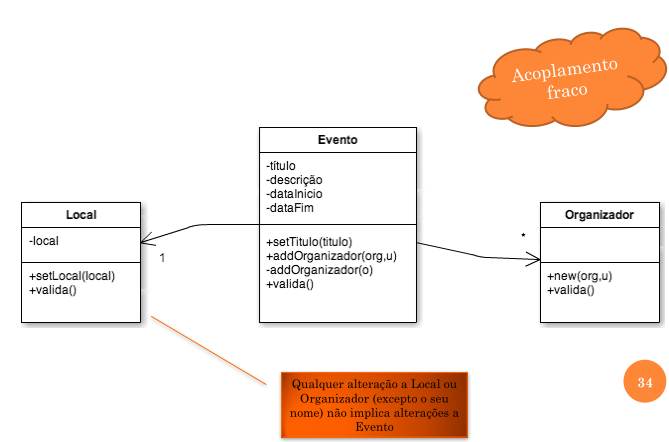

2. **Method references instance *TypeY***
   
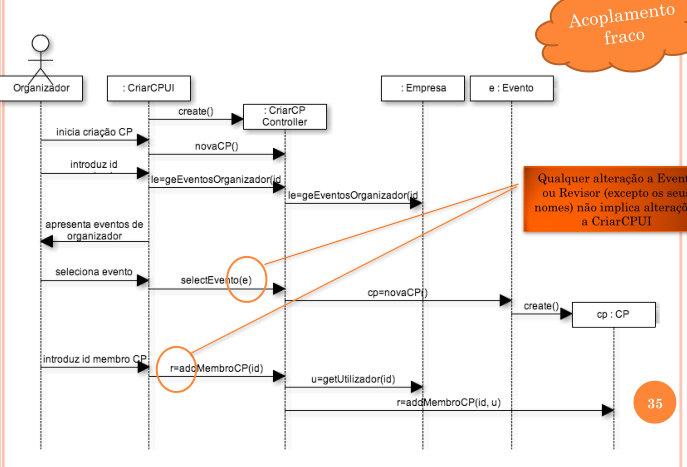

3. ***TypeX* calls services of object *TypeY***

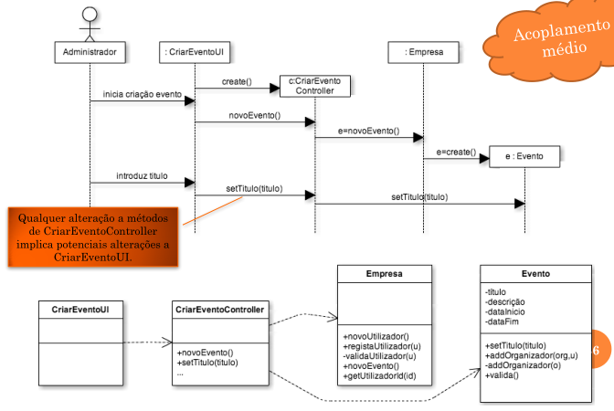

4. ***TypeX* is a subclass of *TypeY***

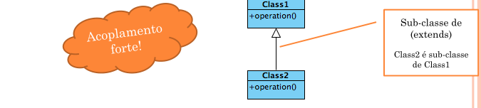

The class inherits the properties of the superclass. The instances of the subclass are part of the superclass but not the other way around.

5. ***TypeX* implements interface *TypeY***

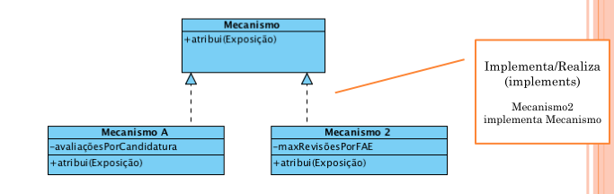

Establishes a contract between the class and the code that uses it. 
- The interface describes what a class the implements the interface can do.
- Mechanism A has to implement method *attribui(Evento)*.

**Interface vs class**

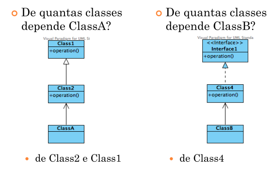

The use of *Interface* implies **lower coupling**.

[Back to top](#software-introduction)

### High Coesion principle

*Cohesion* is a measure for the responsability given to an element. A highly cohese class usually had a restrict number of operations and cooperate or delegate with other classes to solve more complex tasks.

A class with **low cohesion** is:
- Hard to undertand;
- Hard to reuse;
- Hard to maintain;
- Dependent on other classes.

A class with **high cohesion** is:
- Easier to understand the design behind it;
- Easier to maintain and improve;
- Low coupling is suported;
- Reuse if favored because high cohesion allows for reuse of a very specific functionality.

**Problem**: How to keep object with cohere functionalities and easy to comprehend? 

**Solution**: Give responsability in a way that cohesion and cooperation between functionalities is high. Delegate responsabilities.

[Back to top](#software-introduction)

### Polymorphism principle

Polymorphism is a a principle that states how a system should be organized to treat variations of a similar behaviour. 

e.g. Add a new classe *Mechanism* will have less impact in the software design than implementing the algorithms in a single class. Some of the advantages of this are:

- Easier to add new variations
- New implementations can be added without addecting the clients

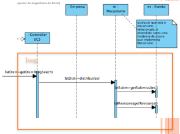

**Problem**: How to use alternatives based on type (classes)? How to build replaceable software components?

**Solution**: When alternatives or behaviours change according to type, polymorphic operations should be used. Polymorphism states that polymorphic operations should be used instead of decisions based on type.

e.g. How to support multiple algorithms for applications? The application should be able to integrrate various types of algorithms for applications. The integration should be done with the least amount possible of design in the software application (modularity). Various classes are created that implement the same interface (IAlgorithmAttribution). The implementation of each method *Attribution(Event)* will be different. 

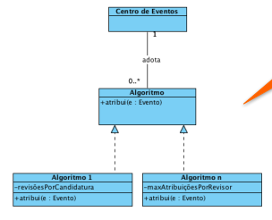

[Back to top](#software-introduction)

### Indirection principle

[Back to top](#software-introduction)

### Pure Fabrication principle

**Problem**: What object should have responsability, when trying to achieve *high cohesion* and *low coupling* but other patterns (e.g. *information expert*) are not appropriate?

**Solution**: Give the responsability to an "artificial" class, for convenience, following the pattern *Pure Fabrication*. It is a class that does not represent a domains concept but amasses a coherent group of responsabilities that are not appropriate to give to domain classes.

An example to illustrate the need for a *pure fabrication*:

In an exhibition app, what class should be responsible for saving data of an exhibition? According to *information expert* pattern the *Exhibition* class should be responsible because it contains all the necessary information to be saved. However... Putting that responsability under the Exhibition class would lead to a *higher coupling* between classes and lower the chaces of reuse because persistency would be tied to the *Exhibition* class.

The solution to this problem is to decouple the persistency from the *Exhibition* class and create a class that has the responsability to save objects *PersistentStorage*.

[Back to top](#software-introduction)

### Protected Variations principle

**Problem**: How to make objects, component and systems in a way that does not have an undesirable impact in other elements?

**Solution**: Identify predictable variation points. Give responsabilities to create a stable interface.

e.g. car vs tire;
Event Center vs Assignement algorithms;
Different attribution algorithms.

The *point of variation* - also called *instability point* - is where different API and interfaces should exist for those services. The interfaces colaborate with a stable interface. Different implementations hide the variations of those algorithms.

e.g. attribute(Event e)

**VER MELHOR O QUE É PROTECTED VARIATIONS. NÃO PERCEBI MUITO BEM**

[Back to top](#software-introduction)

## What is Modularity?

Modularity is the property of a system to be **decomposed** into a set of cohere, low coupling, modules. **High cohesion** and **low coupling** promote modularity. 

e.g. car vs tire

**Low modularity** is usually a sign of bad design because low modularity promotes:

- *Rigidity*: It is difficult to make changes because there are too many dependent parts of the system.
- *Fragility*: When changes are made it is difficult to antecipate behaviour.
- *Immutability*: It is hard to reuse for another application because it is too dependent of the original app.

[Back to top](#software-introduction)

---

## What is extension, implementation and association (and how to represent in UML)?

**Expandir esta secção com mais informação!!!**

**Extension**

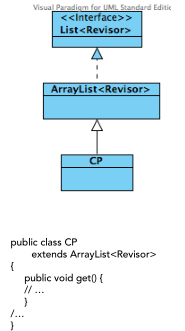

**Implementation**

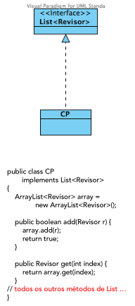

**Association**

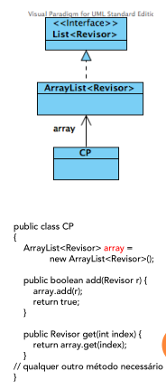

It is best to use **Interfaces instead of Classes!**

e.g. with *Empresa*

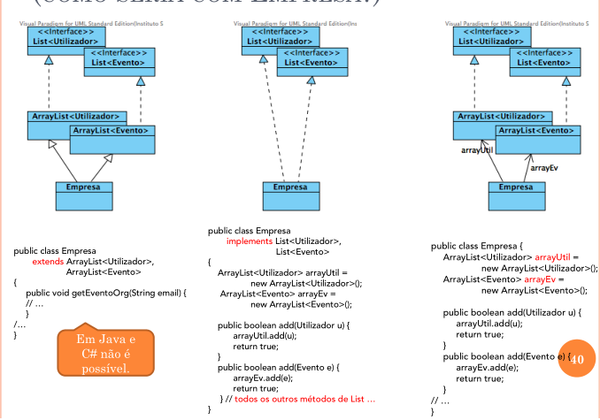

[Back to top](#software-introduction)

## What is Aggregation and Composition?

Aggregation and composition are subtypes of *Type1 association* (see [Low Coupling principle](#low-coupling-principle)). 

When no subtype is defined, it should be considered *Type1*, subtype *aggregation*.

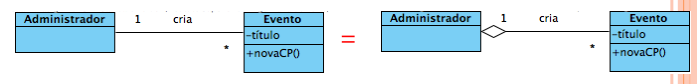

*Composition* means that the instances contained in a collection are erased or removed if the instance that contains the collections is erased or removed.

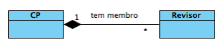

**Example Aggregations vs Composition**

*CP* has various *ticket inspector*. When *CP* is removed, each *ticket inspector* should be removed. **This is composition**.

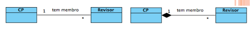

*Admin* creates multiple *Event*. When *Admin* is removed, ech on of those *Event* should not be removed because the *Company* organizes multiple *Event*. **This is aggregation**.

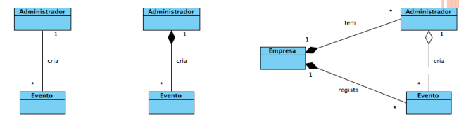

**Subclasses and Coupling**

Subclasses are heavily dependent of their superclass. Usually, high coupling of very stable and used elements is not a problem (e.g. java native libraries)

[Back to top](#software-introduction)

## UML

**Arrows**

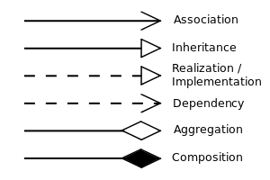

[Back to top](#software-introduction)

### Class Diagram

[Back to top](#software-introduction)

## Anti-pattern STUPID

**S** - Singleton : One  instance per class (global state).

**T** - Tight Coupling : Too dependent

**U** - Untestability : Not possible to test (that makes it unreliable)

**P** - Premature Optimization : Trying to optimize too early. Get it working first!

**I** - Indiscriptive Naming : Unrelated naming

**D** - Duplication : Repeated code over the system (related to DRY principle)

## SOLID

**S** - Single Responsability Principle (SRP) : Each module, classe or function should have one single responsability attributed (High Cohesion). If a class has more than one responsability then the responsabilities are coupled e.g. User vs Author/Organizor. 
Solution: Use Composition & 
Inheritance (interface)

**O** - Open/Closed Principle (OCP) : *Open for Extension, Closed for modification.*
*If the code works, don't change, extend it!* It is equivalent to *Protected Variation*. e.g. Distribution mechanisms. 
Solution: Inheritance (interface).

**L** - Liskov Substitution Principle (LSP) : *Functions that use pointers to base classes must be able to use objects of derived classes without knowing it*.
*Square* class is not *Rectangle* class even if both have methods *setWidth(x)* and *setHeight(y)*. The behaviour of a square is not the same behaviour of a rectangle. Extrinsic behaviour should also be accountable, not just intrinsic behaviour.

**I** - Interface Segregation Principle (ISP) : Multiple interfaces per client are better than one single "fat" interface (these are not cohesive). Combine Single Responsability Responsability with Polymorphism and High Cohesion. Separate a "fat" interface into various single interfaces for each client. 

**D** - Dependency Inversion Principle (DIP) : Abstractions should not depend on details. Details should depend on abstractions. Methods should not use classes, they should use interfaces. 
Solution: Program for Interface and not for Implementation.

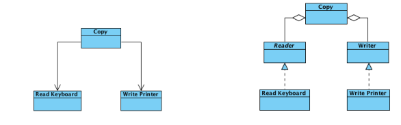

[Back to top](#software-introduction)

## CLASSIC VIEW VS MODERN VIEW

**Classic view**: “(conceptually) is-a”:
- Herança de implementação, i.e. extends

**Modern view**: “behaves as a”:
- Herança de interface, i.e. implements
  
[Back to top](#software-introduction)

---

# Sources

- PP ESOFT 2015-2016 Requisitos, analise e design (Switch)
- PP ESOFT 2016-2017 Design OO (T) IT2 (Switch)

[Back to top](#software-introduction)

# References

- http://www.dcs.bbk.ac.uk/~niki/SoftwareEngineer
ing.htm

- http://www.cse.lehigh.edu/~glennb/oose/oose.htm
Rational Unified Process: Best Practices for
Software Development Teams; Rational Software
White Paper; TP026B, Ver 11/01.

- Rational Unified Process:
http://www.ts.mah.se/RUP/RationalUnifiedProce
ss/index.htm

- Applying UML and Patterns; Craig Larman; (2nd
ed.); 2002.

- Applying UML and Patterns; Craig Larman; (2nd
ed.); 2002.

[Back to top](#software-introduction)

[Go to wiki](./../../README.md)

